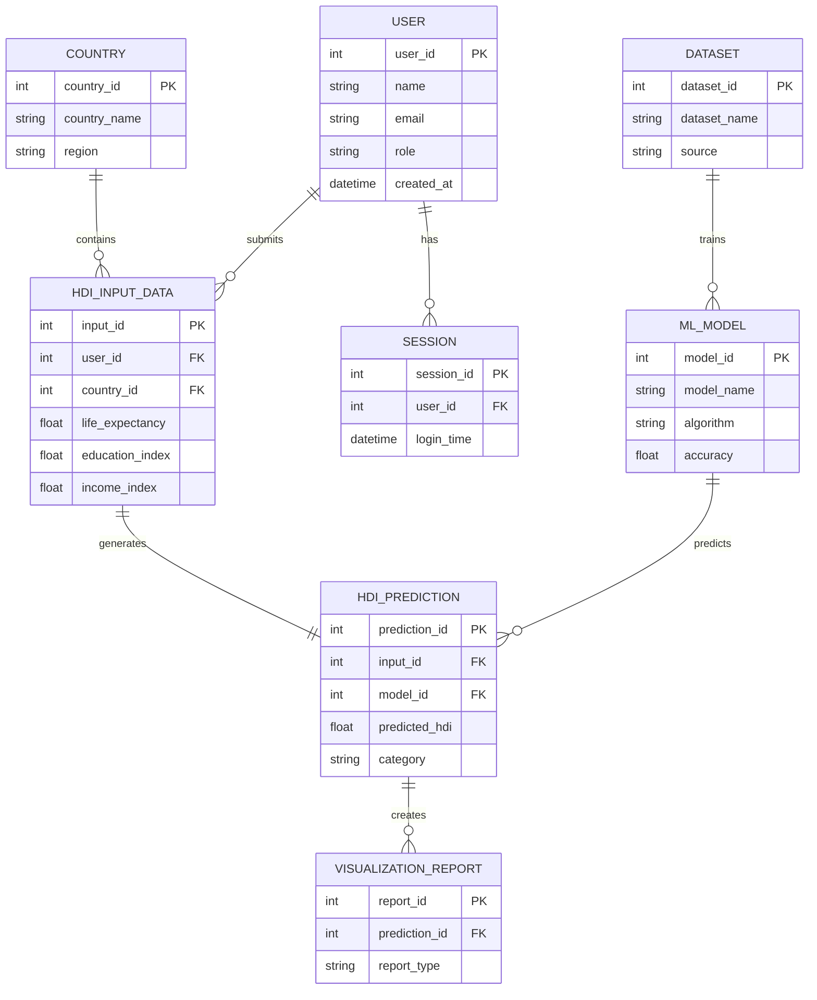

# Entity Relationship Diagram

```mermaid
erDiagram

    USER {
        int user_id PK
        string name
        string email
        string role
        datetime created_at
    }

    COUNTRY {
        int country_id PK
        string country_name
        string region
    }

    HDI_INPUT_DATA {
        int input_id PK
        int user_id FK
        int country_id FK
        float life_expectancy
        float education_index
        float income_index
    }

    ML_MODEL {
        int model_id PK
        string model_name
        string algorithm
        float accuracy
    }

    HDI_PREDICTION {
        int prediction_id PK
        int input_id FK
        int model_id FK
        float predicted_hdi
        string category
    }

    DATASET {
        int dataset_id PK
        string dataset_name
        string source
    }

    VISUALIZATION_REPORT {
        int report_id PK
        int prediction_id FK
        string report_type
    }

    SESSION {
        int session_id PK
        int user_id FK
        datetime login_time
    }

    USER ||--o{ HDI_INPUT_DATA : submits
    COUNTRY ||--o{ HDI_INPUT_DATA : contains
    HDI_INPUT_DATA ||--|| HDI_PREDICTION : generates
    ML_MODEL ||--o{ HDI_PREDICTION : predicts
    HDI_PREDICTION ||--o{ VISUALIZATION_REPORT : creates
    DATASET ||--o{ ML_MODEL : trains
    USER ||--o{ SESSION : has
```
